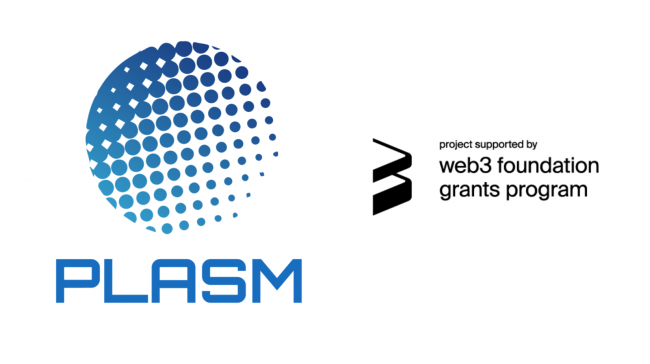

**ステイクテクノロジーズ株式会社（本社：東京都港区、代表取締役：渡辺 創太、以下「ステイク」）は、自社の開発するパブリックブロックチェーン Plasm Network（プラズムネットワーク）をローンチし Web3 財団の主催する Web3.0 Bootcamp にてアジア 15 社の 1 社として選出されたことを発表しました。**

## Plasm Network とは

Plasm Network は、ステイクの開発する日本発レイヤー 1 パブリックブロックチェーンです。Plasm Network には、ブロックチェーンのスケーラビリティ問題を解決するために、レイヤー 1 の Plasm Network 上にレイヤー 2 ソリューションが実装されています。そして、Web3 財団、Parity Technologies 社の開発する Polkadot というパブリックブロックチェーンに接続されることが見込まれています。Polkadot は、異なるブロックチェーンを接続するブロックチェーンであり、ブロックチェーンの課題の一つでもあるであるインターオペラビリティ（相互運用性）を解決します。、Plasm Network は、スケーラビリティの問題をレイヤー 2 ソリューションを提供することによって解決し、Polkadot に接続することによって Ethereum や Bitcoin など異なるブロックチェーンとのインターオペラビリティの担保をします。

現時点において（2020/05/08 9:00 時点）、Polkadot に接続予定のブロックチェーンの内、**世界で 3 番目に大きなネットワークを形成**しており、**アメリカや中国、欧州など世界 63 拠点にノードが参加者により運営されています。**

また、Plasm Network は過去に Web3 財団の助成金プログラムに複数回採択、アメリカの名門大学である UC Berkeley の主催するブロックチェーンアクセラレーションプログラムに選出、Polkadot の公式なライトペーパーに記載、プロダクト事前参加申し込みでは世界中から 31 日で 16,783 ETH（日本円にして約 3 億円）がステイクの作成したスマートコントラクトにロックされるなどグローバルで知名度を向上させています。

※Web3 財団とは？
Ethereum の共同創業者兼 CTO である Gavin Wood（ギャヴィンウッド）氏が中心となるブロックチェーン財団であり、ブロックチェーンを用いて次世代の Web である Web3.0 の実現を目指しています。

※Parity Technlogies とは？
Parity Technologies は Gavin Wood 氏が中心となる株式会社で、過去、ブロックチェーンの発展に多大な寄与をしています。Polkadot は Parity が開発を主導しており、Parity が開発した Ethereum のクライアントである Parity Ethereum は Ethereum 開発の最も重要な開発者ツールの 1 つとなっています。

## Web3 Bootcamp とは？

Web3 Bootcamp（Web3 ブートキャンプ）とは、Web3 財団が中国の Wanxiang Blockchain Labs（ワンシャンブロックチェーンラボ）や New Chainbase の支援の元、アジアの Web3.0 企業を対象に中国で開催するインキュベーションプログラムであり、アジアで 15 社が選出されました。対象期間は 6 ヶ月であり、期間中には技術的な支援、資金調達の支援、ネットワークの提供などの支援を得ることができます。

Web3 Bootcamp: https://bootcamp.web3.foundation/#program

## 各人コメント

**代表取締役社長 渡辺創太**  
「この度、Plasm Network のメインネットローンチおよび、Web3 Bootcamp の参加を発表することができました。弊社は同時期に UC Berkeley の主催するブロックチェーンアクセラレーションプログラムにも採択されており、中国とアメリカで会社とプロダクトのプレゼンスを向上させていく予定です。海外で培ってきた知見や技術を国内企業むけに提供するサービスも開始しており、日本、中国、アメリカの 3 拠点でパートナーと共に引き続き勝負していきたいと考えています。」

**最高技術責任者 山下琢巳**  
「予てより計画していた Plasm Network のメインネットをローンチできて非常に嬉しく思います。それに伴い今までプロダクトを支え関心を持っていただいたコミュニティメンバーやチームメンバーに多大な謝辞を述べさせたていただきます。そして、Plasm Network は次のフェーズへと移ります。2020 Q4 を目標に Polkadot に接続しホワイトペーパーにあるすべての機能を有効にします。Plasm Network の今後の発展にご期待、そしてお付き合いして頂ければ幸いです。」
